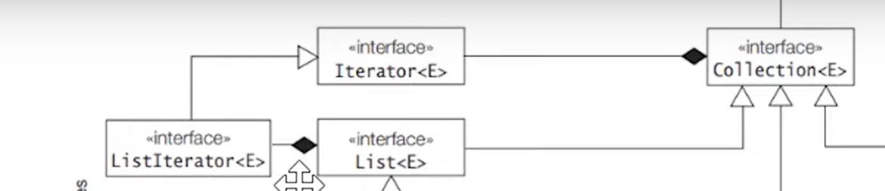
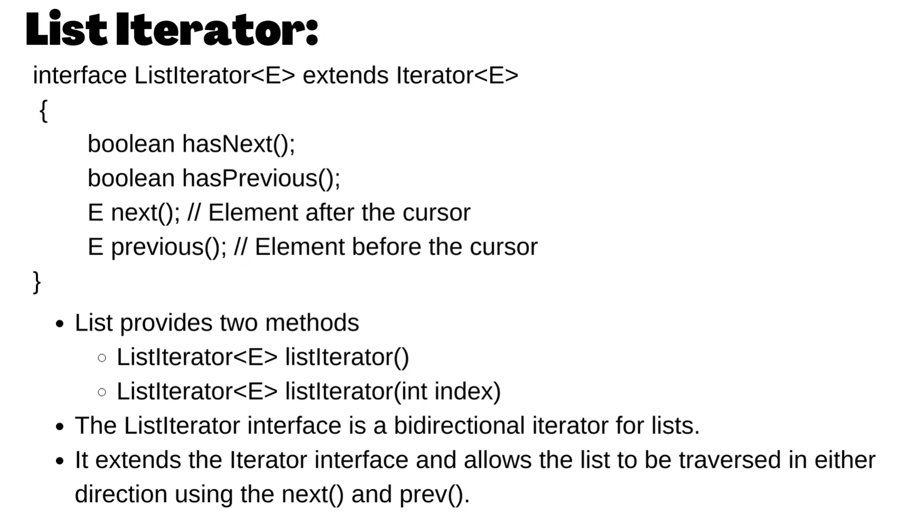

<h1>Collections demo</h1>

Heirarchy:

Any Collection class that extends Iterable can be able to iterate over their collections 

"Collection" interface extends "Iterable" interface.

Collection(I) Heirarchy:

<h2>Collection Interface contains below methods</h2>

List:

<h3>Implementation classes of List are: </h3>

<h2>ArrayList</h2>

<h2>Vector:</h2>

<h3>ArrayList VS LinkedList</h3>

<h2>List(I) also extends ListIterator(I):</h2>

ListIterator(I) Typically we use this in LINKEDLIST 
