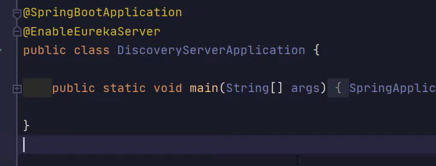
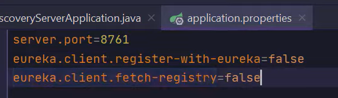
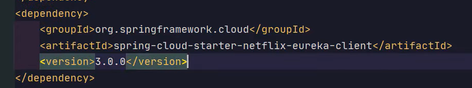
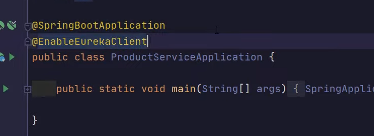
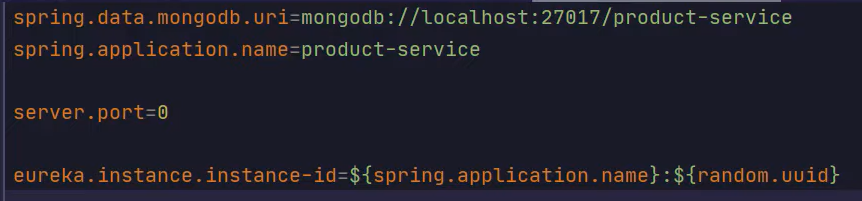

Eureka Server: 

and enable it at Root app level:

And in App.yml or App.prop:

Eureka Client:

And at app root 

In App.props:

sever.port = 0 : Tells server to take any  free port available.

To run multiple instances. Go to Edit configuration and inside that 
check "Allow parallel run" check box and run the same service again
thus 2 services will run in parallel and will be registered under 
"Eureka dashboard" as well.

